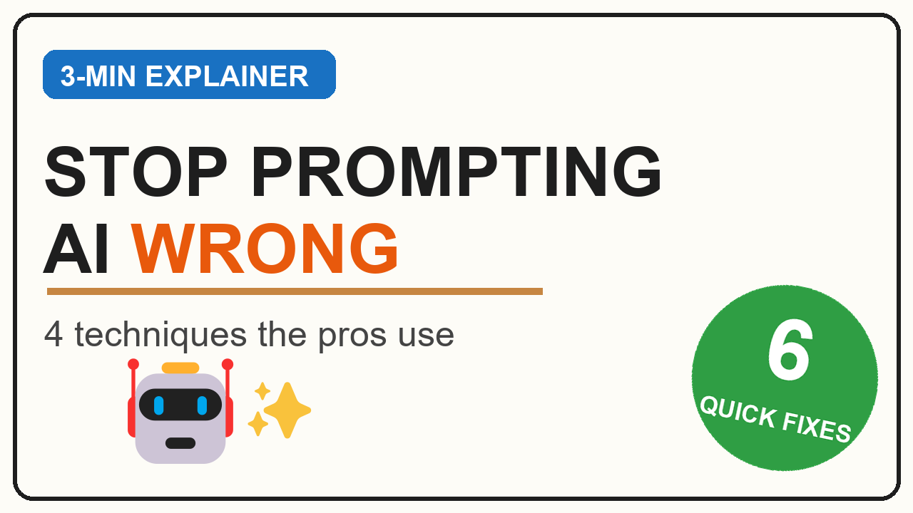
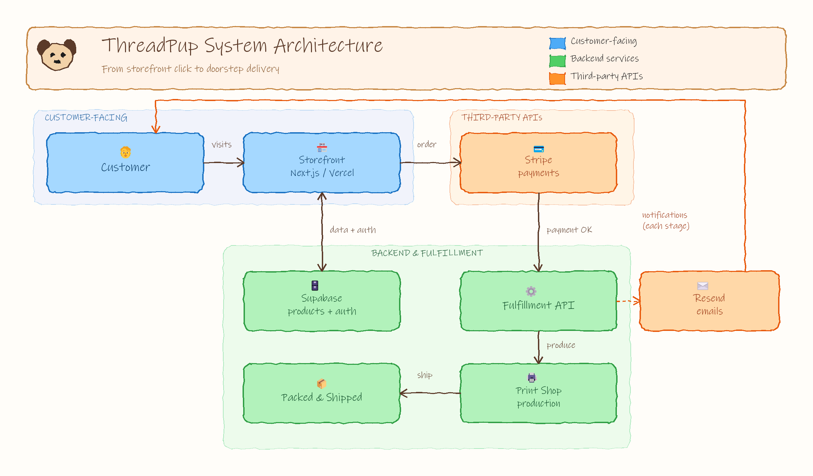
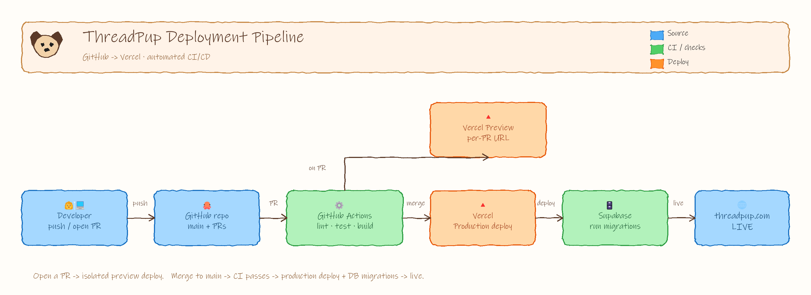
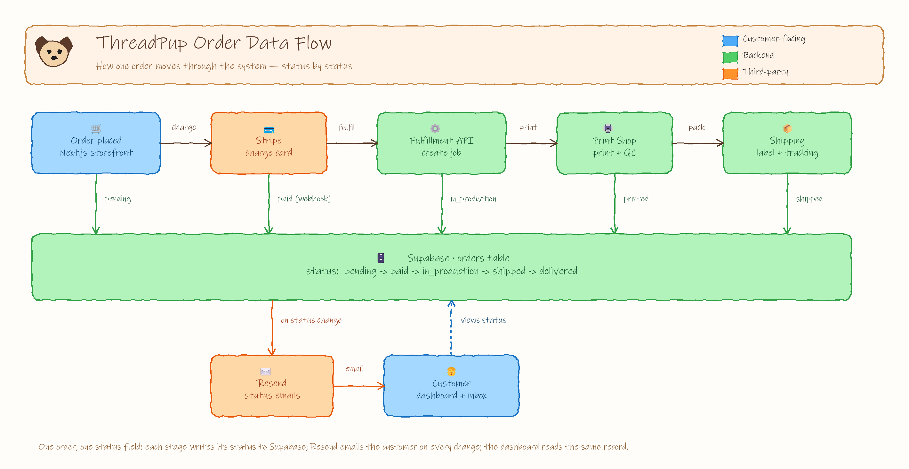
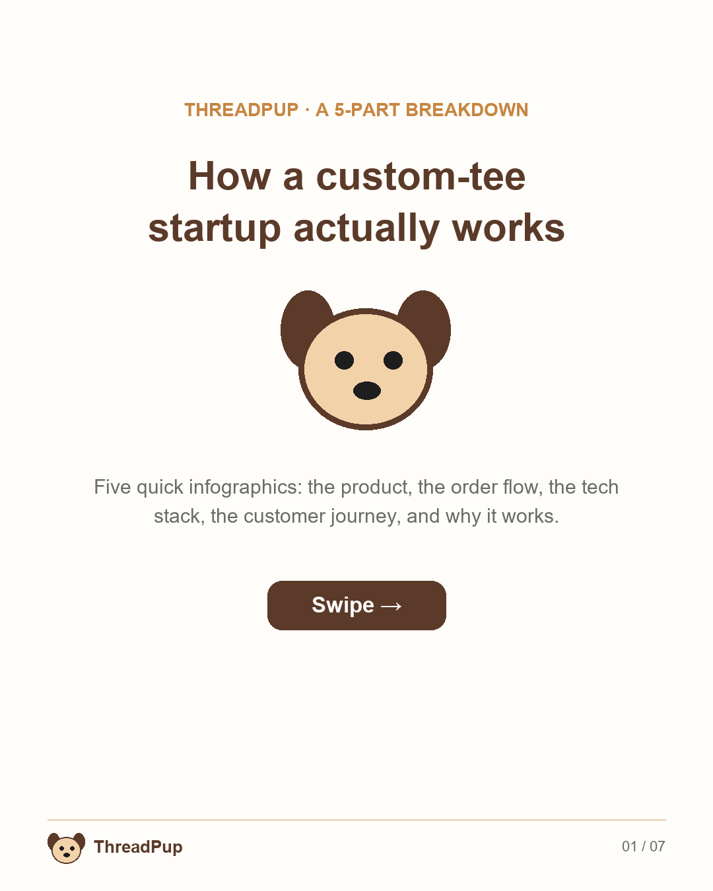
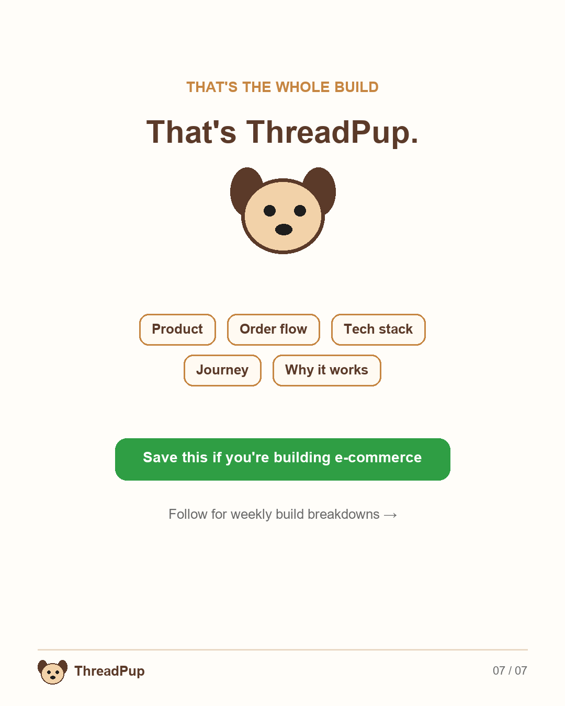

# AI Visual Content Portfolio

Turning topics and product docs into **client-ready visual content** — YouTube
explainer assets, technical diagrams, and social-media infographics — using two
complementary AI-assisted methods. Built end to end: research → script/spec →
generate → adversarial QA → packaged deliverables.

This repo is the **Block 6** capstone: three full scenarios, each shipped as
finished, ready-to-use assets, with the process kept visible (drafts, iteration
logs, build scripts).

---

## Two methods — and when to use each

| | **Method A — AI image generation** | **Method B — Excalidraw / vector** |
|---|---|---|
| Tool | Kie.ai *Nano Banana 2* (`task-1-kie-infographics/generate_infographic.py`) | Excalidraw spec → PNG/`.excalidraw` pipeline + Excalidraw MCP |
| Strength | Rich, illustrative, hand-drawn *look*; fast to explore styles | Precise, editable, perfectly on-brand, **reproducible & consistent**, free |
| Weakness | No seed → style drifts; can garble secondary text | More setup per diagram |
| Used for | **Scenario 1** explainer frames | **Scenario 2** diagrams & **Scenario 3** infographics |

**Why Method B for Scenario 3 (the method-selection call):** the five LinkedIn
posts had to look like *one set*. A template guarantees identical palette,
typography, mascot, and footer across all five; an AI model has no seed and drifts
between images. Method A's strength (expressive illustration) is showcased in
Scenario 1 instead. In short: **AI generation where look matters more than
precision; Excalidraw/vector where consistency and editability matter more.**

---

## Scenario 1 — YouTube Explainer Pack  *(Method A)*
A complete, ready-to-record explainer on prompt engineering: **3-minute script,
thumbnail, hook, and 5 infographic frames (1920×1080)** packaged in one folder.

📁 [`task-5-youtube-frames/explainer-pack/`](task-5-youtube-frames/explainer-pack/) — script · thumbnail · hook · 5 frames
📝 [`task-5-youtube-frames/PROMPT-ITERATIONS.md`](task-5-youtube-frames/PROMPT-ITERATIONS.md) — full prompt/model-comparison write-up (process)



The 5 key visual moments: **Hook → Problem → Concept (4 techniques) → Example
(chain-of-thought) → Summary + CTA.**

---

## Scenario 2 — ThreadPup Technical Documentation  *(Method B)*
Three editable Excalidraw diagrams for *ThreadPup* (a print-on-demand custom-tee
platform), exported as **PNG + `.excalidraw`**, plus a kept **draft** for process.

📁 [`task-3-threadpup/`](task-3-threadpup/) · 🔗 [live Excalidraw share link](https://excalidraw.com/#json=Nu6vDyRJbGCNWqYvvbJMD,3rbbD0q8YYJxRDV1DeVdGQ) (deployment pipeline) · 📄 [open/export guide](task-3-threadpup/links.md)

| System architecture | Deployment pipeline | Order data flow |
|---|---|---|
|  |  |  |

- **System architecture** — services & connections (customer-facing / backend / third-party).
- **Deployment pipeline** — GitHub → Vercel CI/CD with a per-PR preview branch.
- **Order data flow** — one order, status by status, written to Supabase; Resend notifies; dashboard reads. ([draft kept](task-3-threadpup/data-flow.draft.png).)

---

## Scenario 3 — ThreadPup Social Media Kit  *(Method B)*
A week of LinkedIn content: **5 standalone infographics** (one business aspect
each, identical style) + a **7-slide carousel** (scroll-stopping cover → 5 aspects
→ CTA) + ready-to-post captions.

📁 [`task-4-linkedin-carousel/content-kit/`](task-4-linkedin-carousel/content-kit/) · ✍️ [captions (Mon–Fri)](task-4-linkedin-carousel/content-kit/captions.md)

| Cover | The 5 aspects | CTA |
|---|---|---|
|  | product · order flow · tech stack · journey · why it works |  |

---

## Repo map
| Folder | Role |
|--------|------|
| `task-5-youtube-frames/` | **Scenario 1** — explainer pack (+ `build_pack.py`, iteration log) |
| `task-3-threadpup/` | **Scenario 2** — 3 diagrams (+ `make_diagrams.py`, `to_excalidraw.py`, `render_preview.py`) |
| `task-4-linkedin-carousel/` | **Scenario 3** — content kit (+ `build_kit.py`) |
| `task-1-kie-infographics/` | Method A tool — the Kie.ai generator (supporting) |
| `task-2-prompt-carousel/` | Earlier prompt-engineering carousel (source for S1, bonus) |
| `task-6-client-customization/` | Re-skin demo: one palette change re-brands a whole diagram (bonus) |

## Reproduce
```bash
# Scenario 1 — repackage frames at 1920x1080 + thumbnail
py task-5-youtube-frames/build_pack.py
# Scenario 2 — build diagrams -> .excalidraw + PNG
py task-3-threadpup/make_diagrams.py
py task-3-threadpup/to_excalidraw.py task-3-threadpup/*.excalidraw.json
py task-3-threadpup/render_preview.py task-3-threadpup/data-flow.excalidraw.json --scale 2 --rough --out data-flow.png
# Scenario 3 — build 5 posts + 7-slide carousel
py task-4-linkedin-carousel/build_kit.py
```
Method A needs a `KIE_API_KEY` in `task-1-kie-infographics/.env` (git-ignored). All
PNGs were checked by fresh-context QA subagents for legibility, overlaps, and
label clearance before shipping.

## Block 6 deliverables → checklist
| Checklist item | Where |
|---|---|
| Infographic Output | `task-4-…/content-kit/post-1..5.png` (+ S1 frames) |
| Excalidraw Diagrams | `task-3-threadpup/*.png` + `*.excalidraw` (3 diagrams) |
| Excalidraw Draft | `task-3-threadpup/data-flow.draft.excalidraw(.json/.png)` |
| LinkedIn Carousel | `task-4-…/content-kit/carousel/slide-01..07.png` |
| YouTube Explainer Pack | `task-5-youtube-frames/explainer-pack/` |
| Output from 1 of 2 Methods (+ why) | Both shipped; method rationale above |
| Block 6 Deliverables | All three scenarios complete + this portfolio |

---
*Built with Claude Code. Methods: Kie.ai Nano Banana 2 (AI image generation) · Excalidraw + Python render pipeline.*
